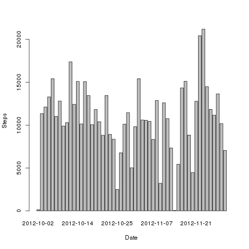

# Reproducible Research: Peer Assessment 1
==========================================

## Loading and preprocessing the data

```r
url = "https://d396qusza40orc.cloudfront.net/repdata%2Fdata%2Factivity.zip"
download.file(url, destfile="repdata-data-activity.zip", method="curl")
unzip("repdata-data-activity.zip")
dataImport <- read.csv("activity.csv")
```

## Mean total number of steps taken per day
### Histogram of the total number of steps taken each day

```r
stepsPerDate <- aggregate(steps ~ date, data = dataImport, FUN = sum)
barplot(stepsPerDate$steps, names.arg = stepsPerDate$date, xlab = "Date", ylab = "Steps")
```

 

### Mean and median total number of steps taken per day

```r
mean(stepsPerDate$steps)
```

```
## [1] 10766
```

```r
median(stepsPerDate$steps)
```

```
## [1] 10765
```

## Average daily activity pattern
### Times series plot of the 5-minute interval and the average number of steps taken

```r
stepsPerInterval <- aggregate(steps ~ interval, data = dataImport, FUN = mean)
plot(stepsPerInterval, type = "l", xlab = "Interval", ylab = "Steps")
```

 

### Five-minute interval with maximum number of steps

```r
stepsPerInterval$interval[which.max(stepsPerInterval$steps)]
```

```
## [1] 835
```

```r
which.max(stepsPerInterval$steps)
```

```
## [1] 104
```

## Imputing missing values
### Total number of missing values

```r
sum(is.na(dataImport))
```

```
## [1] 2304
```

### Creating a new dataset with the missing data filled in

```r
dataImport <- merge(dataImport, stepsPerDate, by = "date", suffixes = c("", ".y"))
nas <- is.na(dataImport$steps)
dataImport$steps[nas] <- dataImport$steps.y[nas]
dataImport <- dataImport[, c(1:3)]
```

### Histogram of the total number of steps taken each day

```r
stepsPerDate <- aggregate(steps ~ date, data = dataImport, FUN = sum)
barplot(stepsPerDate$steps, names.arg = stepsPerDate$date, xlab = "Date", ylab = "Steps")
```

 

### Mean and median total number of steps taken per day

```r
mean(stepsPerDate$steps)
```

```
## [1] 10766
```

```r
median(stepsPerDate$steps)
```

```
## [1] 10765
```

## Differences in activity patterns between weekdays and weekends

```r
daytype <- function(date) {
    if (weekdays(as.Date(date)) %in% c("Saturday", "Sunday")) {
        "Weekend"
    } else {
        "Weekday"
    }
}
dataImport$daytype <- as.factor(sapply(dataImport$date, daytype))

par(mfrow = c(2, 1))
for (type in c("Weekend", "Weekday")) {
    steps.type <- aggregate(steps ~ interval, data = dataImport, 
        subset = dataImport$daytype == type, FUN = mean)
    plot(steps.type, type = "l", main = type, xlab = "Interval", ylab = "Steps")
}
```

 
